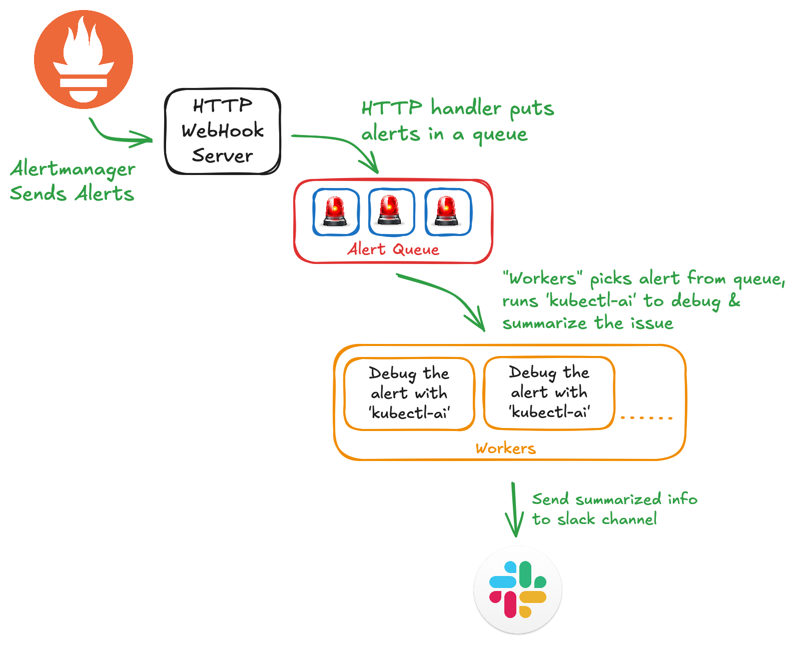

# K8s AI Detective

K8s AI Detective is a tool designed to automate debugging and summarizing issues when an alert is triggered. It leverages [`kubectl-ai`](https://github.com/GoogleCloudPlatform/kubectl-ai) to analyze the alert context, gather relevant information (such as logs, events, and resource states), and generate an initial summary.

> What is `kubectkl-ai`?
> kubectl-ai acts as an intelligent interface, translating user intent into precise Kubernetes operations, making Kubernetes management more accessible and efficient.
>
> https://github.com/GoogleCloudPlatform/kubectl-ai

## Usage

```bash
Usage: k8s-ai-detective --api-key=STRING [flags]

K8s AI Detective automates debugging and summarizing alerts by leveraging `kubectl-ai` to analyze context, gather logs, events, and resource states, and generate an initial
summary.

Flags:
  -h, --help                                   Show context-sensitive help.
      --address=":8080"                        The address where the server should listen on ($ADDRESS).
      --config-file-path="./config.yml"        Config file path ($CONFIG_FILE_PATH).
      --llm-provider="gemini"                  Language model provider ($LLM_PROVIDER)
      --llm-provider-model="gemini-2.5-pro"    LLM provider's model name ($LLM_PROVIDER_MODEL)
      --api-key=STRING                         API key of the llm-provider you set for authentication ($API_KEY)
      --kubeconfig=""                          Path to kubeconfig file (uses in-cluster config if not set) ($KUBECONFIG)
      --worker-count=3                         Number of alerts processed in parallel (Max 256) ($WORKER_COUNT).
      --alert-queue-size=10                    Queue size to hold alerts (Max 256) ($ALERT_QUEUE_SIZE).
      --slack-bot-token=""                     Slack bot token for authentication ($SLACK_BOT_TOKEN).
      --slack-channel-id=""                    Slack channel ID to send notifications ($SLACK_CHANNEL_ID).
      --log.format="json"                      Set the output format of the logs. Must be "console" or "json" ($LOG_FORMAT).
      --log.level=INFO                         Set the log level. Must be "DEBUG", "INFO", "WARN" or "ERROR" ($LOG_LEVEL).
      --log.add-source                         Whether to add source file and line number to log records ($LOG_ADD_SOURCE).
```

## How it Works?



## Build & Test

- Using [Taskfile](https://taskfile.dev/)

_Install Taskfile: [Installation Guide](https://taskfile.dev/docs/installation)_

```bash
# List available tasks
task --list
task: Available tasks for this project:
* all:                   Run comprehensive checks: format, lint, security and test
* build:                 Build the application binary for the current platform
* build-docker:          Build Docker image
* build-platforms:       Build the application binaries for multiple platforms and architectures
* fmt:                   Formats all Go source files
* install:               Install required tools and dependencies
* lint:                  Run static analysis and code linting using golangci-lint
* run:                   Runs the main application
* security:              Run security vulnerability scan
* test:                  Runs all tests in the project      (aliases: tests)
* vet:                   Examines Go source code and reports suspicious constructs

# Build the application
task build

# Run tests
task test
```

- Build with [goreleaser](https://goreleaser.com/)

_Install GoReleaser: [Installation Guide](https://goreleaser.com/install/)_

```bash
# Build locally
goreleaser release --snapshot --clean
...
```

## Further Development

- [ ] Context logging with `slog`
- [ ] Better de-duplication of alerts with `fingerprint` while processing
- [ ] More options config
  - [ ] Exclude/include specific alerts
  - [ ] Dedicated prompt for specific alerts
  - [ ] Exclude alert groups
  - [ ] Exclude namespaces
- [ ] Metrics
